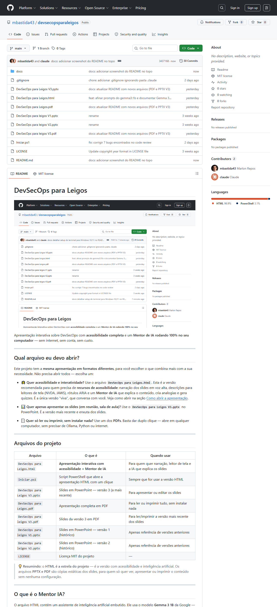

# DevSecOps para Leigos



Apresentação interativa sobre DevSecOps com **acessibilidade completa** e um **Mentor de IA rodando 100% no seu computador** — sem internet, sem conta, sem custo.

---

## Qual arquivo eu devo abrir?

Este projeto tem a **mesma apresentação em formatos diferentes**, para você escolher o que combina mais com a sua necessidade. Não precisa abrir todos — escolha um:

- 🌟 **Quer acessibilidade e interatividade?** Use o arquivo **`DevSecOps para Leigos.html`**.
  Esta é a versão recomendada para quem precisa de **recursos de acessibilidade**: narração dos slides em voz alta, descrições para leitores de tela (NVDA, JAWS), rótulos ARIA e um **Mentor de IA** que explica o conteúdo, cria analogias e gera quizzes. É a única versão "viva", que conversa com você. Veja como abrir na seção [Como abrir a apresentação](#como-abrir-a-apresentação-uso-diário).

- 📊 **Quer apenas apresentar os slides (em reunião, sala de aula)?** Use o **`DevSecOps para Leigos V3.pptx`** no PowerPoint. É a versão mais recente e enxuta dos slides.

- 📄 **Quer só ler ou imprimir, sem instalar nada?** Use um dos **PDFs**. Basta dar duplo clique — abre em qualquer computador, sem precisar de Ollama, Python ou internet.

---

## Arquivos do projeto

| Arquivo | O que é | Quando usar |
|---|---|---|
| `DevSecOps para Leigos.html` | **Apresentação interativa com acessibilidade + Mentor de IA** | Para quem quer narração, leitor de tela e a IA que explica os slides |
| `Iniciar.ps1` | Script PowerShell que abre a apresentação HTML com um clique | Sempre que for usar a versão HTML |
| `DevSecOps para Leigos V3.pptx` | Slides em PowerPoint — versão 3 (a mais recente) | Para apresentar ou editar os slides |
| `DevSecOps para Leigos.pdf` | Apresentação completa em PDF | Para ler ou imprimir tudo, sem instalar nada |
| `DevSecOps para leigos V3.pdf` | Slides da versão 3 em PDF | Para ler/imprimir a versão mais recente dos slides |
| `DevSecOps para leigos V1.pptx` | Slides em PowerPoint — versão 1 (histórico) | Apenas referência de versões anteriores |
| `DevSecOps para leigos V2.pptx` | Slides em PowerPoint — versão 2 (histórico) | Apenas referência de versões anteriores |
| `LICENSE` | Licença MIT do projeto | — |

> 💡 **Resumindo:** o **HTML é a estrela do projeto** — é a versão com acessibilidade e inteligência artificial. Os arquivos **PPTX e PDF** são cópias estáticas dos slides, para quem só quer ver, apresentar ou imprimir o conteúdo sem nenhuma configuração.

---

## O que é o Mentor IA?

O arquivo HTML contém um assistente de inteligência artificial embutido. Ele usa o modelo **Gemma 3 1B** da Google — um modelo open source leve (cerca de 1 bilhão de parâmetros) que roda diretamente no seu computador, sem precisar enviar nada para a internet.

> ⚡ **Por que o modelo leve (1B)?** Ele foi escolhido para responder **rápido mesmo em computadores modestos**. As respostas aparecem em **streaming** (palavra por palavra, em tempo real) e começam em poucos segundos. Modelos maiores (como o `gemma3:4b`) dão respostas um pouco mais elaboradas, mas ficam lentos em máquinas sem uma GPU moderna — veja a seção [Quer trocar o modelo?](#quer-trocar-o-modelo-avançado).

O Mentor consegue:
- Responder perguntas sobre DevSecOps em Português do Brasil
- Gerar quizzes e ajustar a dificuldade automaticamente conforme você acerta ou erra
- Narrar o conteúdo de cada slide com voz e explicação inteligente
- Criar analogias criativas para cada conceito
- Explicar automaticamente o slide que você está vendo ao rolar a página

---

## Antes de começar — Abra e configure o PowerShell

Todos os comandos deste projeto são executados no **PowerShell**. Siga os passos abaixo para ter um terminal moderno e atualizado no seu Windows.

---

### Como abrir o PowerShell

**No Windows 10:**
1. Pressione as teclas **Windows + R** ao mesmo tempo
2. Digite `powershell` e pressione **Enter**

Ou:
- Clique no botão **Iniciar** com o botão **direito** do mouse
- Selecione **Windows PowerShell**

**No Windows 11:**
- Clique no botão **Iniciar** com o botão **direito** do mouse
- Selecione **Terminal** ou **Terminal do Windows**

---

### Instale o Windows Terminal (recomendado)

O **Windows Terminal** é um terminal moderno da Microsoft — mais bonito, mais rápido e com abas. É gratuito e está disponível na Microsoft Store ou pelo `winget`.

Primeiro, verifique se o `winget` está disponível no seu Windows:

```powershell
winget --version
```

Se aparecer algo como `v1.x.x`, o winget está disponível. Então instale o Windows Terminal:

```powershell
winget install --id Microsoft.WindowsTerminal
```

> O `winget` já vem instalado no **Windows 11** e no **Windows 10** atualizado (versão 1809 ou superior com a atualização de maio de 2020). Se o comando não funcionar, instale o Windows Terminal diretamente pela **Microsoft Store** — procure por "Windows Terminal".

---

### Instale a versão mais recente do PowerShell

O Windows vem com o **Windows PowerShell 5.1** (versão antiga). A versão moderna chama-se **PowerShell 7+** e é mais rápida e completa. Instale pelo winget:

```powershell
winget install --id Microsoft.PowerShell --source winget
```

Após instalar, **feche e reabra o terminal** e confirme a versão:

```powershell
$PSVersionTable.PSVersion
```

Deve aparecer `Major` igual a `7` ou superior. Se ainda mostrar `5`, abra o programa **PowerShell 7** pelo menu Iniciar (procure por "PowerShell 7").

---

## Pré-requisitos — instale uma vez, use sempre

### Passo 1 — Instalar o Ollama

O Ollama é o programa que roda o modelo de IA no seu computador. Pense nele como um "player de vídeo", mas para modelos de IA.

1. Acesse **[ollama.com](https://ollama.com)** no seu browser
2. Clique no botão **Download for Windows**
3. Execute o arquivo `OllamaSetup.exe` que foi baixado
4. Siga o instalador normalmente (Next, Next, Install)
5. Após instalar, o Ollama aparecerá como um ícone na barra de tarefas (canto inferior direito da tela)

Para confirmar que deu certo, abra o **PowerShell** e execute:

```powershell
ollama --version
```

Deve aparecer algo como `ollama version is 0.30.11`. Se aparecer, está instalado.

---

### Passo 2 — Baixar o modelo Gemma 3 1B

Com o Ollama instalado, agora você precisa baixar o "cérebro" da IA. No **PowerShell**, execute:

```powershell
ollama pull gemma3:1b
```

> O download tem aproximadamente **815 MB**. Vai levar poucos minutos dependendo da sua internet. Execute esse comando apenas uma vez — o modelo fica salvo no seu computador.

Quando terminar, aparecerá a mensagem `success`.

---

### Passo 3 — Configurar permissão de comunicação (CORS)

A apresentação HTML precisa de permissão para conversar com o Ollama. Isso é uma configuração de segurança padrão dos browsers. Execute **uma única vez** no PowerShell:

```powershell
[System.Environment]::SetEnvironmentVariable("OLLAMA_ORIGINS", "*", "User")
```

> Esse comando salva a configuração permanentemente no seu Windows. Não precisa repetir.

Depois, **reinicie o Ollama** para que ele leia a nova configuração:

1. Olhe no canto inferior direito da tela (onde fica o relógio)
2. Clique na seta `˄` para mostrar os ícones ocultos
3. Clique com o **botão direito** no ícone do Ollama (parece uma bolinha)
4. Clique em **Quit**
5. Reabra o Ollama pelo menu **Iniciar** do Windows

---

### Passo 4 — Instalar o Python

O Python é necessário para servir a apresentação localmente. Sem ele, o browser bloqueia a comunicação com o Ollama por segurança.

Verifique se já está instalado:

```powershell
python --version
```

Se aparecer `Python 3.x.x`, já está pronto. Pode pular este passo.

Se não aparecer, instale pelo winget (forma mais fácil — já adiciona ao PATH automaticamente):

```powershell
winget install --id Python.Python.3 --source winget
```

Após instalar, **feche e reabra o terminal** e confirme:

```powershell
python --version
```

Deve aparecer algo como `Python 3.13.x`.

**Alternativa:** se preferir instalar manualmente, baixe em **[python.org/downloads](https://python.org/downloads)** e execute o instalador. Durante a instalação, marque obrigatoriamente a opção **"Add Python to PATH"** antes de clicar em Install Now.

> ⚠️ Se não marcar "Add Python to PATH", o comando `python` não será reconhecido no terminal.

---

## Como abrir a apresentação (uso diário)

Após concluir os 4 passos acima, o uso diário é simples:

### Opção A — Usando o script PowerShell (recomendado)

1. Certifique-se que o **Ollama está rodando** (ícone na barra de tarefas)
2. Abra o **PowerShell** na pasta do projeto
3. Execute:

```powershell
.\Iniciar.ps1
```

> Se aparecer um erro de política de execução, execute este comando uma vez e tente novamente:
> ```powershell
> Set-ExecutionPolicy -Scope CurrentUser RemoteSigned
> ```

4. O browser abre automaticamente com a apresentação
5. Quando terminar, volte ao PowerShell e pressione **ENTER** para encerrar o servidor

### Opção B — Abrindo manualmente (alternativa)

Se preferir não usar o script, você mesmo pode iniciar o servidor. No PowerShell, dentro da pasta do projeto:

```powershell
python -m http.server 3000
```

Depois abra o browser e acesse:

```
http://localhost:3000/DevSecOps%20para%20Leigos.html
```

Quando terminar, volte ao PowerShell e pressione `Ctrl + C` para encerrar.

---

## Por que não posso abrir o HTML direto com duplo clique?

Boa pergunta! Quando você abre um arquivo HTML dando duplo clique, o browser o executa com o protocolo `file://`. Nesse modo, por segurança, o browser bloqueia qualquer comunicação de rede — inclusive com o Ollama rodando localmente.

Ao usar o servidor Python (`http.server`), o arquivo é servido via `http://localhost`, e o browser permite a comunicação normalmente.

**Resumo:** duplo clique = protocolo `file://` = IA bloqueada. Servidor Python = protocolo `http://` = IA funcionando.

---

## Funcionalidades da apresentação

### Acessibilidade
- **Narração de slides** — botão "🔊 Ouvir Slide" em cada slide lê o conteúdo em voz alta
- **Textos para leitores de tela** — descrições ocultas compatíveis com NVDA e JAWS
- **ARIA completo** — todos os elementos interativos têm rótulos acessíveis

### Inteligência Artificial (requer Ollama + Gemma rodando)
- **🤖 Narrar com IA** — Gemma explica o slide em linguagem simples e lê em voz alta
- **🎨 Analogia** — Gemma cria uma analogia do dia a dia para o conceito do slide
- **🤖 Auto IA** — ativa explicação automática ao rolar os slides (toggle no chat)
- **📝 Quiz adaptativo** — perguntas geradas pela IA com dificuldade que sobe conforme você acerta
- **📋 Resumo** — resumo executivo das 8 fases do DevSecOps gerado pela IA
- **Chat** — tire dúvidas em texto com o Gemma a qualquer momento
- **⚡ Respostas em streaming** — o texto aparece palavra por palavra, em tempo real, sem ficar esperando a resposta inteira ficar pronta

---

## Modelo de IA utilizado

### Hardware desta máquina (detectado automaticamente)

| Componente | Modelo | Geração |
|---|---|---|
| Processador | Intel Core i7-4790K @ 4,0 GHz — 4 núcleos / 8 threads | **4ª geração Intel (Haswell, 2014)** |
| Placa de vídeo | NVIDIA GeForce GT 640 | **1 GB de VRAM / ~28 GB/s de banda** |

### Por que usamos o `gemma3:1b`?

A GPU desta máquina tem apenas **1 GB de VRAM** — insuficiente para carregar qualquer modelo Gemma maior na placa de vídeo. O `gemma3:1b` foi escolhido porque:

- Pesa **815 MB** — cabe na **RAM do sistema** (sem precisar de GPU)
- Responde em **poucos segundos** mesmo rodando só no processador
- O i7-4790K (4ª geração, 2014) ainda dá conta para inferência de modelos pequenos

| Propriedade | Valor |
|---|---|
| Modelo em uso | `gemma3:1b` (Gemma 3 — 1 bilhão de parâmetros) |
| Desenvolvedor | Google |
| Licença | Open source (Gemma Terms of Use) |
| Execução | 100% local via Ollama |
| Comando para baixar | `ollama pull gemma3:1b` |
| Tamanho do download | ~815 MB |
| VRAM mínima necessária | nenhuma — roda na RAM do sistema |

---

## Quer trocar o modelo? (avançado)

O modelo usado fica definido em **uma única linha** dentro do arquivo `DevSecOps para Leigos.html`. Procure por:

```javascript
const OLLAMA_MODEL = 'gemma3:1b';
```

Para usar outro modelo, baixe-o com `ollama pull <modelo>` e troque o nome nessa linha.

---

### Família Gemma 3 (disponível no Ollama)

| Modelo | Parâmetros | Download | VRAM mínima | Quando usar |
|---|---|---|---|---|
| `gemma3:1b` ⭐ **padrão** | 1B | ~815 MB | nenhuma (roda na RAM) | Qualquer máquina, mesmo sem GPU |
| `gemma3:4b` | 4B | ~3,3 GB | ~6 GB | GPU com ≥ 6 GB de VRAM |
| `gemma3:12b` | 12B | ~8,1 GB | ~10 GB | GPU com ≥ 12 GB de VRAM |
| `gemma3:27b` | 27B | ~17 GB | ~20 GB | GPU high-end (RTX 3090, 4090...) |

---

### Família Gemma 4 (geração mais recente do Google, 2025)

O **Gemma 4** é a família mais recente do Google e traz dois tipos de modelos:

- **Modelos `e` (mobile/on-device):** `e2b` e `e4b` — usam **Per-Layer Embeddings**, ativando apenas uma fração dos parâmetros por token gerado. São muito eficientes em VRAM e extremamente rápidos em GPUs modernas.
- **Modelos densos:** `12b`, `26b`, `31b` — arquitetura tradicional com mais capacidade de raciocínio.

| Modelo | Parâmetros efetivos | Download | VRAM mínima | Contexto | Quando usar |
|---|---|---|---|---|---|
| `gemma4:e2b` | 2,3B efetivos | ~7,2 GB | ~9 GB | 128K | **Menor Gemma 4** — GPU ≥ 8 GB (RTX 4060, 3070...) |
| `gemma4:e4b` | 4,5B efetivos | ~9,6 GB | ~11 GB | 128K | GPU ≥ 12 GB (RTX 3080, 4070...) |
| `gemma4:12b` | ~12B | ~7,6 GB | ~10 GB | 256K | GPU ≥ 12 GB |
| `gemma4:26b` | 3,8B ativos (MoE) | ~18 GB | ~20 GB | 256K | GPUs high-end (RTX 3090, 4090, 5080...) |
| `gemma4:31b` | 30,7B | ~20 GB | ~22 GB | 256K | GPUs topo de linha |

> ℹ️ **O que é MoE?** O `gemma4:26b` usa **Mixture of Experts** — o modelo tem 25B de parâmetros no arquivo, mas ativa apenas ~3,8B por token gerado. Resultado: arquivo grande (18 GB de VRAM), mas geração muito rápida depois de carregado.

---

### Para GPUs de alto desempenho — exemplo com RTX 5090

A **RTX 5090** tem **32 GB de VRAM** e banda de memória de **~1.800 GB/s** — uma das GPUs mais rápidas disponíveis. Com ela, todos os modelos Gemma 4 cabem na VRAM. A estimativa de velocidade:

```
tokens por segundo ≈ banda de memória (GB/s) ÷ dados lidos por token (GB)
```

| Modelo | Cabe na VRAM? | Velocidade estimada (RTX 5090) |
|---|---|---|
| `gemma4:e2b` (2,3B efetivos) | ✅ Sim (usa ~9 GB) | ~1800 ÷ 2,3 ≈ **~780 tok/s** teórico; na prática **~200–400 tok/s** — literalmente mais rápido que se lê |
| `gemma4:e4b` (4,5B efetivos) | ✅ Sim (usa ~11 GB) | **~150–300 tok/s** |
| `gemma4:26b` (3,8B ativos) | ✅ Sim (usa ~20 GB) | **~100–200 tok/s** com qualidade muito superior |
| `gemma4:31b` | ✅ Sim (usa ~22 GB) | **~80–150 tok/s** |

**➡️ Recomendação para RTX 5090:** comece pelo `gemma4:e2b` (menor e mais rápido) ou vá direto para o `gemma4:26b` se quiser máxima qualidade — ambos cabem com folga nos 32 GB de VRAM.

**Baixar e ativar o `gemma4:e2b`:**

```powershell
ollama pull gemma4:e2b
```

No arquivo `DevSecOps para Leigos.html`, troque a linha do modelo para:

```javascript
const OLLAMA_MODEL = 'gemma4:e2b';
```

---

### Tabela resumo: qual modelo usar conforme sua GPU?

| GPU | VRAM | Modelo recomendado |
|---|---|---|
| GeForce GT 640 / sem GPU dedicada | 1 GB / nenhuma | `gemma3:1b` ⭐ (padrão deste projeto) |
| GTX 1650 / RTX 3050 | 4 GB | `gemma3:1b` ou `gemma3:4b` (lento) |
| RTX 3060 / RTX 4060 | 8–12 GB | `gemma3:4b` ou `gemma4:e2b` |
| RTX 3070 / RTX 4070 | 8–12 GB | `gemma4:e2b` ou `gemma4:e4b` |
| RTX 3080 / RTX 4080 | 10–16 GB | `gemma4:e4b` ou `gemma4:12b` |
| RTX 3090 / RTX 4090 | 24 GB | `gemma4:26b` |
| **RTX 5090** | **32 GB** | **`gemma4:e2b`** (velocidade) ou **`gemma4:26b`** (qualidade) |

> ⚠️ **Máquinas sem GPU dedicada ou com menos de 4 GB de VRAM:** mantenha o `gemma3:1b`. Modelos maiores vão rodar pela CPU e podem levar minutos por resposta.

---

## Solução de problemas

**O Mentor IA não responde / aparece mensagem de erro**
- Verifique se o Ollama está rodando (ícone na barra de tarefas)
- Verifique se você abriu a apresentação pelo servidor (`http://localhost:3000`) e não por duplo clique direto
- Confirme que a variável OLLAMA_ORIGINS foi configurada (Passo 3) e que o Ollama foi reiniciado depois

**O Mentor IA está muito lento para responder**
- Use **apenas uma aba** da apresentação aberta por vez. Várias abas mandam perguntas ao mesmo tempo e dividem a memória do computador, deixando tudo lento.
- A **primeira** pergunta após abrir a página é naturalmente mais lenta (~10s), porque o modelo está sendo carregado na memória. As seguintes vêm em poucos segundos.
- Se você editou o HTML e a mudança não apareceu, o navegador pode estar usando uma versão antiga em **cache**. Recarregue com `Ctrl + Shift + R`, ou abra uma **janela anônima** (`Ctrl + Shift + N`), que ignora o cache.
- Confirme que o modelo em uso é o leve: a saudação do chat deve dizer **"Gemma 3 1B"**.

**A voz não fala / narração não funciona**
- A narração usa a Web Speech API do browser — funciona melhor no Microsoft Edge e Google Chrome
- Certifique-se de que o volume do sistema não está no mudo

**Erro "python não é reconhecido"**
- O Python não está instalado ou não foi adicionado ao PATH
- Reinstale o Python marcando a opção "Add Python to PATH"

---

## Licença

[MIT License](LICENSE).
